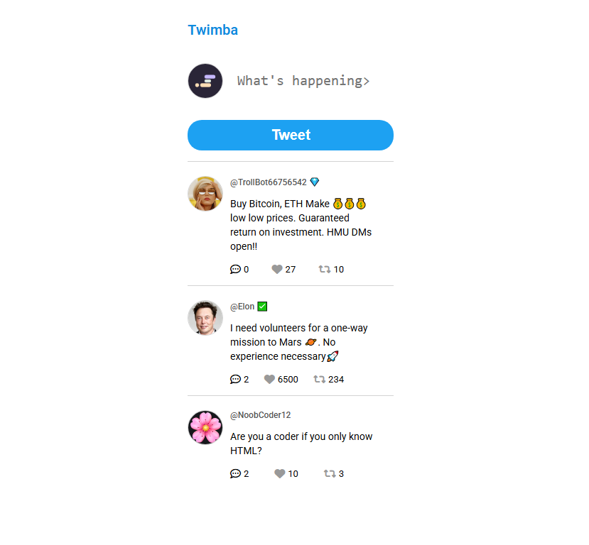
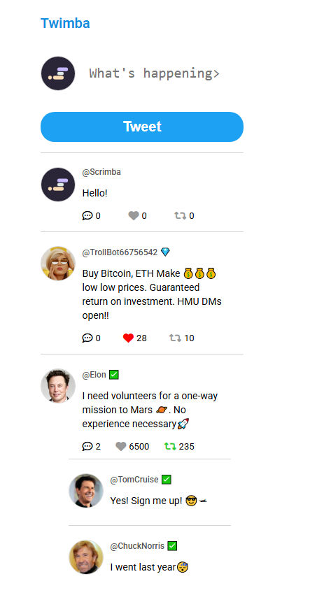

# Simple twitter clone

This is a project from [Scrimba course](https://scrimba.com/frontend-path-c0j)

### Screenshot

## Table of contents

-   [Screenshot](#screenshot)
-   [Overview](#overview)
    -   [Links](#links)

## Overview

Twimba is a simplified Twitter clone built with HTML, CSS, and JavaScript (focusing heavily on JavaScript). The main goal of the project was to practice DOM manipulation, event handling, and working with dynamic data structures in a front-end environment.

Key features include:

Posting tweets dynamically.

Liking and retweeting functionality with visual feedback.

Replying to tweets (expandable replies).

Real-time UI updates using pure JavaScript.

Clean, mobile-friendly layout with minimal design.

The project uses modular JavaScript and simulates a basic feed structure with tweet objects stored in memory. Each tweet includes likes, retweets, and replies, and is uniquely identified using UUID. No backend or persistent storage is used – everything runs client-side.

This project helped deepen my understanding of how front-end logic powers user interactions in social media platforms.

### Links

-   Live Site URL: [live site](https://sage-tarsier-b075a8.netlify.app/)
